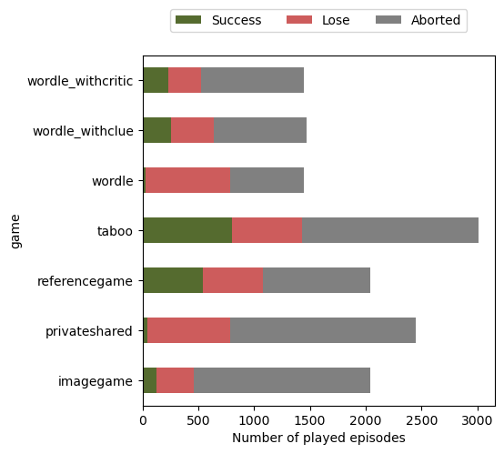
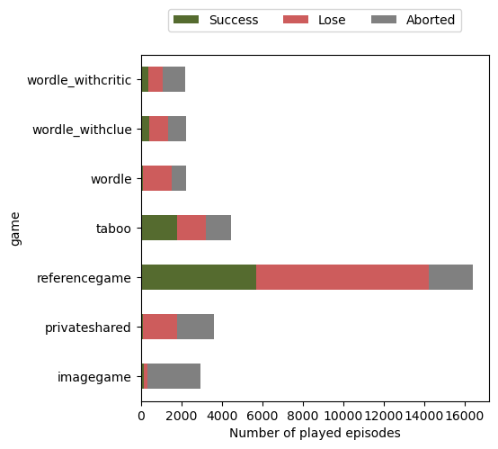
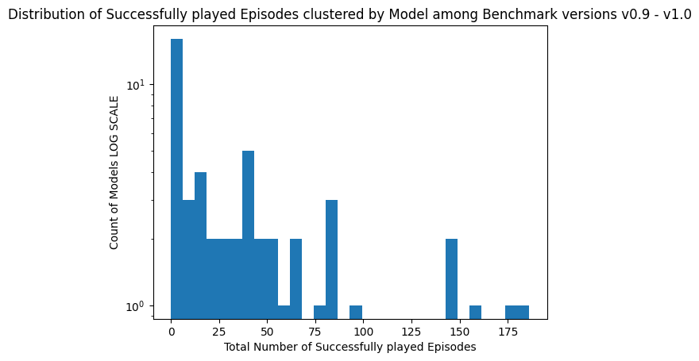
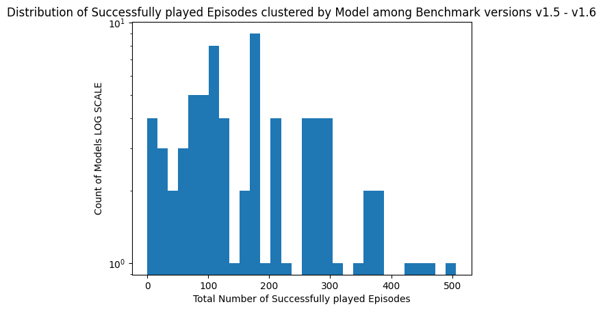
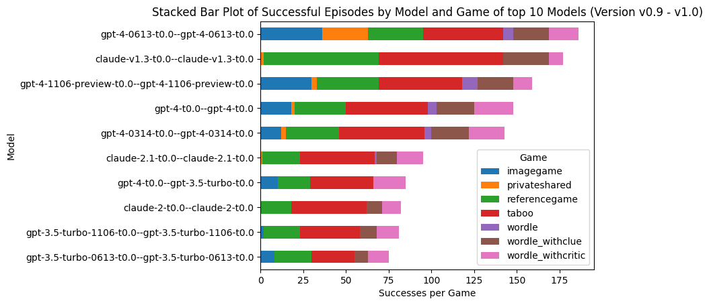
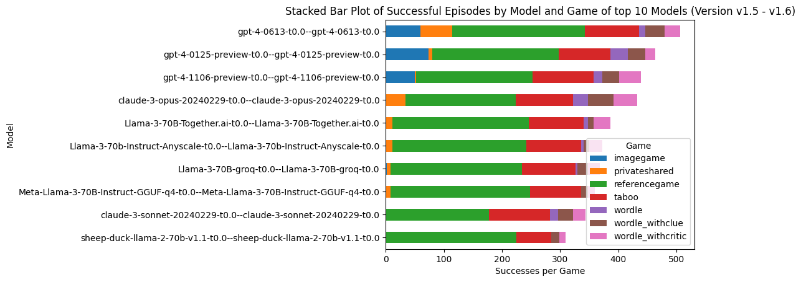

# Findings

## Taboo

### Folder Structure:

```plaintext
Root
├── Benchmark Version (e.g. V0.9)
│   ├── Model Name (vicuna-13b-t0.0--vicuna-13b-t0.0)
│       ├── Game (e.g. Taboo)
│           ├── Game Variants (e.g. 0_high_en)
│               └── episeodes (e.g episode_0)
│                   ├──  instances.json     // contains the info about the word to be guessed
│                   ├──  interactions.json  // contains information about the turns and outcomes
│                   ├──  requests.json      // contains the propmnts and answers

```

### General Info about the available Data:

A game is stored as JSON object with the following structure:

```JSON
{
  "players": {
    "GM": "Game master for taboo",
    "Player 1": "WordDescriber, text-davinci-003",
    "Player 2": "WordGuesser, text-davinci-003"}, 
  "turns": [[{
    "from": "GM",
    "to": "Player 2",
    "timestamp": "2023-06-16T10:47:47.818600",
    "action": {
      "type": "get message", 
      "content": "CLUE: Measurement of something.",
    }}
  ]]
}
```


**turn** contains an array of all turns.
The last turn indicates whether a game ended successful or not.
The turn object contains an action object with the key type. This action type can have the following values:
- "correct guess" -> indicates that a game ended with a correct guess of the player
- "invalid format" -> indicates that a game ended because the answer format was incorrect. This can happen when a related word was used or the output is not in the CLUE: \< ... \> Format
- "max turns reached" -> indicates that a game ended because the maximum amount of turns is reached
- invalid clue -> indicates that a model used a word that it is now allowed too by the game.


### Info clustered by Benchmark Version
### Taboo
| Benchmark Version | Number of Episodes | Number of Successfully Played Episodes | Number of turns | Number of target words |
|-------------------|--------------------|----------------------------------------|-----------------|------------------------|
| v0.9              | 644                | 193                                    | 226             | 52                     |
| v1.0              | 2419               | 641                                    | 739             | 57                     |
| v1.5              | 2400               | 909                                    | 1068            | 60                     |
| v1.5_quantized    | 480                | 131                                    | 163             | 51                     |
| v1.6              | 3180               | 1221                                   | 1488            | 60                     |
| v1.6_backends     | 360                | 224                                    | 326             | 53                     |
| v1.6_quantized    | 360                | 162                                    | 193             | 49                     |

-> 3481 Successfully Played Episodes

### Wordle No Clue No Critic
| Benchmark Version | Number of Episodes | Number of Successfully Played Episodes | Number of turns | Number of target words |
|-------------------|--------------------|----------------------------------------|-----------------|------------------------|
| v0.9              | 269                | 6                                      | 32              | 5                      |
| v1.0              | 1211               | 20                                     | 98              | 13                     |
| v1.5              | 1200               | 65                                     | 320             | 26                     |
| v1.5_quantized    | 240                | 0                                      | 0               | 0                      |
| v1.6              | 1590               | 95                                     | 467             | 27                     |
| v1.6_backends     | 180                | 10                                     | 62              | 5                      |
| v1.6_quantized    | 180                | 3                                      | 21              | 2                      |

-> 199 Successfully Played Episodes

### Wordle With Clue No Critic
| Benchmark Version | Number of Episodes | Number of Successfully Played Episodes | Number of turns | Number of target words |
|-------------------|--------------------|----------------------------------------|-----------------|------------------------|
| v0.9              | 270                | 52                                     | 138             | 22                     |
| v1.0              | 1227               | 216                                    | 525             | 26                     |
| v1.5              | 1200               | 221                                    | 621             | 24                     |
| v1.5_quantized    | 240                | 13                                     | 22              | 6                      |
| v1.6              | 1590               | 312                                    | 865             | 27                     |
| v1.6_backends     | 180                | 36                                     | 111             | 14                     |
| v1.6_quantized    | 180                | 42                                     | 117             | 15                     |

-> 892 Successfully played episodes

### Wordle With Clue and Critic
| Benchmark Version | Number of Episodes | Number of Successfully Played Episodes | Number of turns | Number of target words |
|-------------------|--------------------|----------------------------------------|-----------------|------------------------|
| v0.9              | 319                | 63                                     | 330             | 24                     |
| v1.0              | 1156               | 175                                    | 860             | 26                     |
| v1.5              | 1200               | 178                                    | 1108            | 25                     |
| v1.5_quantized    | 222                | 12                                     | 54              | 8                      |
| v1.6              | 1590               | 260                                    | 1610            | 29                     |
| v1.6_backends     | 179                | 45                                     | 346             | 20                     |
| v1.6_quantized    | 180                | 31                                     | 182             | 17                     |

-> 764 Successfully Played Episodes

### Imagegame

| Benchmark Version          | Number of Episodes | Number of Successfully Played Episodes | 
|----------------------------|--------------------|----------------------------------------|
| v0.9                       | 440                | 35                                     | 
| v1.0                       | 1640               | 88                                     |
| v1.5                       | 1600               | 94                                     |
| v1.5_quantized             | 320                | 400                                    |
| v1.6                       | 2280               | 128                                    | 
| v1.6_backends              | 240                | 1                                      | 
| v1.6_quantized             | 240                | 1                                      | 

-> 747 successful episodes


### Referencegame:

| Benchmark Version          | Number of Episodes | Number of Successfully Played Episodes | 
|----------------------------|--------------------|----------------------------------------|
| v0.9                       | 440                | 141                                    | 
| v1.0                       | 1640               | 434                                    |
| v1.5                       | 7200               | 2769                                   |
| v1.5_quantized             | 1440               | 400                                    |
| v1.6                       | 10260              | 4344                                   | 
| v1.6_backends              | 1080               | 551                                    | 
| v1.6_quantized             | 1080               | 480                                    | 
| _v1.6_multimodal_          |_1620_              | _628_                                  | 

-> 9747 successful episodes


### Private Shared
| Benchmark Version | Number of Episodes | Number of Successfully Played Episodes | Number of turns | Accuracy | Perfect Episodes (acc 1.0) | Perfect Turns (Episode acc=1.0) |
|-------------------|--------------------|----------------------------------------|-----------------|----------|----------------------------|---------------------------------|
| v0.9              | 898                | 139                                    | 1234            | 85.99    | 4                          | 24                              |
| v1.0              | 4096               | 695                                    | 6485            | 74.76    | 46                         | 366                             |
| v1.5              | 3800               | 761                                    | 7056            | 78.16    | 69                         | 529                             |
| v1.5_quantized    | 800                | 112                                    | 1212            | 73.13    | 5                          | 30                              |
| v1.6              | 5100               | 1068                                   | 9803            | 80.06    | 104                        | 799                             |
| v1.6_backends     | 600                | 291                                    | 2646            | 78.93    | 21                         | 126                             |
| v1.6_quantized    | 600                | 279                                    | 2469            | 73.38    | 11                         | 66                              |

-> 220 Perfecly played Episodes (acc = 1.0)

## Overview all games

Barplot of played episodes benchmark versions 0.9-1.0



Barplot of played episodes benchmark versions 1.5-1.6 (including quantized, backends and multimodal results)




## Distribution of Successfully Played Episodes per Model



## Top 10 Models (most successfully played episodes) among all games



