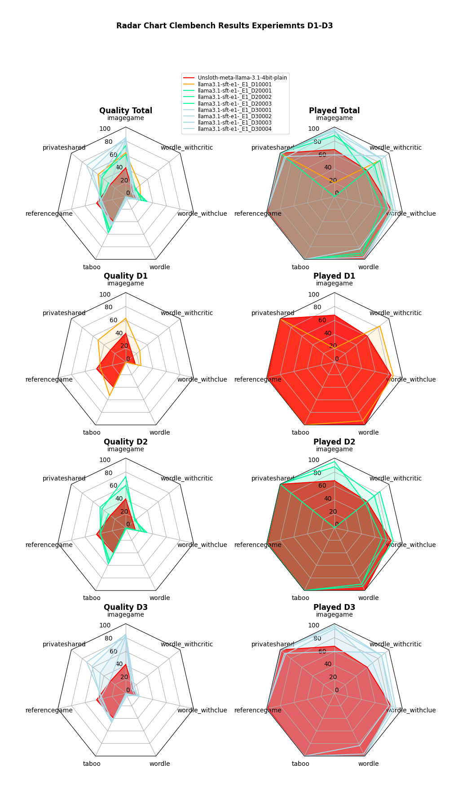
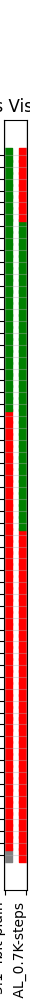
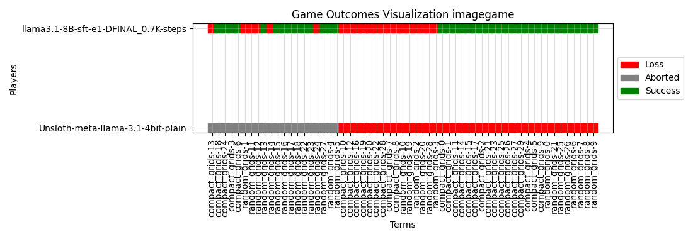
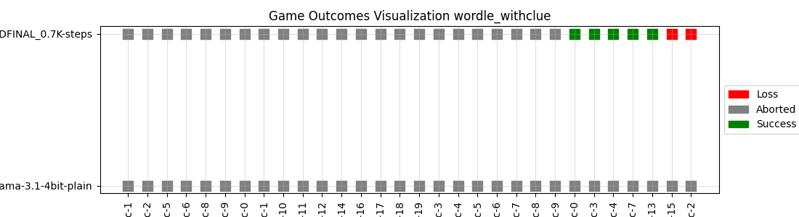
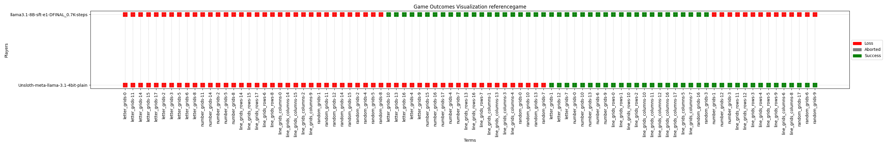
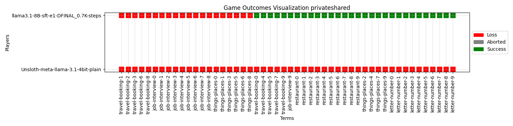

This is the repository for the CLEM-ProjectPlayPen.

[Huggingface Page to Check the Models](https://huggingface.co/Nicohst)

# Data

## Structure

### Extracted Information:
The following columns are extracted for each game:

| Entries              | Descriptions                                                                                                                                                               |
|---------------------|----------------------------------------------------------------------------------------------------------------------------------------------------------------------------|
| game                 | The Game e.g. Taboo, Wordle                                                                                                                                                |
| benchmark_version    | Version of the benchmark the data comes from                                                                                                                               |
| game_id              | Unique identifier for the game instance                                                                                                                                    |
| model                | The Model Name                                                                                                                                                             |
| experiment           | The version of the game e.g. 0_high_en (Taboo) or 1_random_grids  (Imagegame)                                                                                              |
| episode              | The Played Episode                                                                                                                                                         |
| Aborted              | 1 if episode was aborted                                                                                                                                                   |
| Lose                 | 1 if episode was played but ended in loss                                                                                                                                  |
| Success              | 1 if episode ended as a success                                                                                                                                            |
| target               | The objective of the game. e.g. target_word (Taboo), target_grid (Imagegame)                                                                                               |
| chat                 | The whole conversation in the huggingface chat format                                                                                                                      |
| player               | The player that was playing. If a game has two players, there will be the exact same instance twiche but on time with the chat of player 1 and once with chat of player 2. |

A game instance can be identified by combining game-benchmark_version-model-experiment-episode.
If a game has 2 players, the same identifier exists twice. One entry represents the conversation of player 1 and the other one represents
the conversation of player 2.

NOTE: This format only applies to all data in the processed folder. The raw data comes in a similar format but with other game
specific columns that were combined into chat or target to unify the data.

### Raw
Contains all data extracted from the clembench-runs repository without any preprocessing

### Processed
Contains the same data as raw, but in a unified format such that all games can be joined together in one file to create datasets.

NOTE: Image game has been preprocessed to mach the format of the newer benchmark version.
In particular, only the answers of player one were parsed to another format. The content however was not changed.

Further, All games were filtered such that there are no chats that contain any INVALID_FORMAT strings.
This string is set as a placeholder in some games where the model is asked to provide an explanation for the answer.
If there is no explanation, there is a INVALID_FORMAT string. To avoid learning this from the data, episodes where this happened were discarded.

### Training Data
Contains the datasets used for training the models found in hugging face.

The naming of the datasets follows the pattern:  
D[E][XXXX] where E referrs to the experiment number and XXXX is the sub experiment run within an experiment. 

E.g: D10001, is a dataset of experiment 1 and refers to the sub-experiment-0001

### _old
Refers to data from benchmark versions 0.9 and 1.0

### _new
Refers to data from benchmark version > 1.0

# Experiments
### 1. Train on all Successful episodes of all models
**Dataset D10001:** [training_data_D10001.csv](./data/training_data/D10001.csv)

### 2. Train on all Successful episodes of the top n models
Top 10 models (most successful episodes) in the benchmark versions 0.9 and 1.0 combined:

| Place | Item |
|-------|------|
| 1 | gpt-4-0613-t0.0--gpt-4-0613-t0.0 |
| 2 | claude-v1.3-t0.0--claude-v1.3-t0.0 |
| 3 | gpt-4-1106-preview-t0.0--gpt-4-1106-preview-t0.0 |
| 4 | gpt-4-t0.0--gpt-4-t0.0 |
| 5 | gpt-4-0314-t0.0--gpt-4-0314-t0.0 |
| 6 | claude-2.1-t0.0--claude-2.1-t0.0 |
| 7 | gpt-4-t0.0--gpt-3.5-turbo-t0.0 |
| 8 | claude-2-t0.0--claude-2-t0.0 |
| 9 | gpt-3.5-turbo-1106-t0.0--gpt-3.5-turbo-1106-t0.0 |
| 10 | gpt-3.5-turbo-0613-t0.0--gpt-3.5-turbo-0613-t0.0 |

**Dataset n=10 D20001:** [training_data_D20001.csv](./data/training_data/D20001.csv)  
**Dataset n=3 D20002:** [training_data_D20002.csv](./data/training_data/D20002.csv)  
**Dataset n=1 D20003:**  [training_data_D20003.csv](./data/training_data/D20003.csv)  

### 3. Train on partial conversation pieces
The previous experiments all take a whole interaction for an episode and provides only the final answer to learn for the model.
This means that intermediate turns are not to be learned by the model. This experiment takes the whole interaction and splits it into n pieces.

Each piece is on part of the interactions. The last piece contains the whole conversation while the first only contains one instruction and one answer.

Since in some games, the conversation starts with two user inputs before the fist assistant answer, the two consecutive user inputs will be merged into one 
using clench utils functionality. This functionality is in [utils/utils.py](./src/utils/utils.py)

The experimets are the following: 
**Dataset D30001:** [training_data_D30001.csv](./data/training_data/D30001.csv)  Contains the conversation pieces of all successful episodes of all models equivalent to D10001 without split conversations 
**Dataset D30002:** [training_data_D30002.csv](./data/training_data/D30002.csv)  Contains the conversation pieces of all successful episodes of the top 10 models equivalent to D20001 without split conversations 
**Dataset D30003:** [training_data_D30003.csv](./data/training_data/D30003.csv)  Contains the conversation pieces of all successful episodes of the top 3 models equivalent to D20002 without split conversations 
**Dataset D30004:** [training_data_D30004.csv](./data/training_data/D30004.csv)  Contains the conversation pieces of all successful episodes of the top 1 equivalent to D20003 without split conversations 

NOTE: The data was shuffled before it was split to mix the games. During training the data was not further split to keep the order of the conversatoin bits.

### 4. Balance the data:
Currently, all data was used regardless of duplicate entries of game instances. This means, that if all models succeeded in on game, then
the same game instance, e.g. wordle with the same target word will be present as often as there are models in the benchmark and version.

Since some games are "easier" to play by the models than others, there is the situation, that for some games there are hundreds of samples, while for 
others there are just ten to twenty.

The aboce image already indicates that there even in the top 10 models, some games are only Successfully played by the top 5 a.g. privateshared.

To address this issue there can be different strategies of sampling only partial data from the games that are over represented.

1. Random Sampling
2. Only Top k modes: This sampling tries to take as many episodes from one model as possible and of the model does not have any successful episodes from 
one game episode, the next worse model will be checked.

### 5. Play only n games and observe impact on other games
(Find reasonable choice of games to learn from)

### 6. Only take data from the best model per game instance (can be duplicate with top n = 1)

# Model Naming
The model naming follows the pattern: 
[model_name]-[Learning Technique]-E[number of episodes]-[Dataset Identifier]  
**model name** is the name of the base-model 
**Learning Technique** SFT for supervised fine tuning DPO for direct preference optimization 
**E** is the number of trained episodes 
**Dataset Identifier** is the dataset id that was introduced in the previous section  
E.g. meta-llama-Meta-Llama-3.1-8B-Instruct-SFT-E1-D10001

# Result Plots

 

## Taboo

### Words that changed from Success into Lose
| Model              | Word        | num models | word type          |
|--------------------|-------------|------------|--------------------|
| all but D20002     | None        | 7          | concept            |
| D1_1, D2_3, D3_1,2 | Myth        | 4          | concept (Cultural) |
| D1_1, D2_1,2, D3_1 | Autograph   | 4          | concept            |
| D1_1, D3_1,2,3     | Designation | 4          | concept            |
| D2_1,3 D3_3,4      | Sear        | 4          | concept            |
| D3_1,3,4           | Envelope    | 3          | Object             |
| D2_3, D3_2         | Array       | 2          | concept            |
| D2_3, D3_1         | Recorder    | 2          | Object             |
| D3_2,4             | Orient      | 2          | Place (Cultural)   |
| D2_1 D3_2          | Plaza       | 2          | Object             |

### Words that changed from Lose into Aborted
| Model            | Word                   | num models | word type          | Abort Reason         |
|------------------|------------------------|------------|--------------------|----------------------|
| D1_1, D2_1, D3_3 | Photo (high_fre ep3)   | 3          | Object             | No real words        |
| D2_2,3           | Share (high_fre ep1)   | 2          | concept (Cultural) | Invalid word length  |
| D2_2,3           | Swash   (med_fre ep14) | 2          |                    | No real words  ahale |
| D2_1,2           | Trial                  | 2          | concept            |                      |

### Words that changed from Lose into Aborted
| Model            | Word   | num models | word type    |
|------------------|--------|------------|--------------|
| D2_2,3, D3_3,4   | newly  | 4          |              |
| D2_2,3, D3_1,3   | nerdy  | 4          |              |
| D1_1, D2_1, D3_4 | Rifle  | 3          |              |
| D2_2,3           | Carper | 2          |              |
| D2_1,2           | Swash  | 2          | aspid, aspir |
| D2_2, D3_3       | fiery  | 2          |              |
| D2_2, D3_3       | unfed  | 2          |              |
| D2_1, D3_4       | cacao  | 2          |              |

### Words that changed from Lose into Aborted
| Model             | Word   | num models | word type |
|-------------------|--------|------------|-----------|
| D1_1 D2_2,3, D3_3 | fiery  | 3          |           |
| D1_1, D2_2,3      | newly  | 3          |           |
| D2_2,3            | Carper | 2          |           |
| D2_2 D3_3         | Share  | 2          |           |

 

## Game: imagegame
| Model | Success Ratio | Lose Ratio | Abort Ratio |
|-------|---------------|------------|-------------|
| Unsloth-meta-llama-3.1-4bit-plain-t0.0--Unsloth-meta-llama-3.1-4bit-plain-t0.0 | 0.00 | 67.50 | 32.50 |
| llama3.1-sft-e1-_E1_D10001-t0.0--llama3.1-sft-e1-_E1_D10001-t0.0 | 2.50 | 17.50 | 80.00 |
| llama3.1-sft-e1-_E1_D20001-t0.0--llama3.1-sft-e1-_E1_D20001-t0.0 | 0.00 | 0.00 | 100.00 |
| llama3.1-sft-e1-_E1_D20002-t0.0--llama3.1-sft-e1-_E1_D20002-t0.0 | 17.50 | 77.50 | 5.00 |
| llama3.1-sft-e1-_E1_D20003-t0.0--llama3.1-sft-e1-_E1_D20003-t0.0 | 10.00 | 77.50 | 12.50 |
| llama3.1-sft-e1-_E1_D30001-t0.0--llama3.1-sft-e1-_E1_D30001-t0.0 | 35.00 | 57.50 | 7.50 |
| llama3.1-sft-e1-_E1_D30002-t0.0--llama3.1-sft-e1-_E1_D30002-t0.0 | 25.00 | 35.00 | 40.00 |
| llama3.1-sft-e1-_E1_D30003-t0.0--llama3.1-sft-e1-_E1_D30003-t0.0 | 27.50 | 67.50 | 5.00 |
| llama3.1-sft-e1-_E1_D30004-t0.0--llama3.1-sft-e1-_E1_D30004-t0.0 | 25.00 | 72.50 | 2.50 |

### Findings:
**Success Ratio:** Went up between 2.5% and 35%  
**Lose Ratio:** Went up 10% for some models and down 20% for others  
**Aborted Ratio:** Went down for most models except of D10001 and D20001   
**Trend**: Games shifted from Aborted to Lose and Success.

## Game: privateshared
| Model | Success Ratio | Lose Ratio | Abort Ratio |
|-------|---------------|------------|-------------|
| Unsloth-meta-llama-3.1-4bit-plain-t0.0--Unsloth-meta-llama-3.1-4bit-plain-t0.0 | 0.00 | 100.00 | 0.00 |
| llama3.1-sft-e1-_E1_D10001-t0.0--llama3.1-sft-e1-_E1_D10001-t0.0 | 0.00 | 100.00 | 0.00 |
| llama3.1-sft-e1-_E1_D20001-t0.0--llama3.1-sft-e1-_E1_D20001-t0.0 | 0.00 | 100.00 | 0.00 |
| llama3.1-sft-e1-_E1_D20002-t0.0--llama3.1-sft-e1-_E1_D20002-t0.0 | 0.00 | 100.00 | 0.00 |
| llama3.1-sft-e1-_E1_D20003-t0.0--llama3.1-sft-e1-_E1_D20003-t0.0 | 0.00 | 100.00 | 0.00 |
| llama3.1-sft-e1-_E1_D30001-t0.0--llama3.1-sft-e1-_E1_D30001-t0.0 | 2.00 | 88.00 | 10.00 |
| llama3.1-sft-e1-_E1_D30002-t0.0--llama3.1-sft-e1-_E1_D30002-t0.0 | 0.00 | 92.00 | 8.00 |
| llama3.1-sft-e1-_E1_D30003-t0.0--llama3.1-sft-e1-_E1_D30003-t0.0 | 6.00 | 92.00 | 2.00 |
| llama3.1-sft-e1-_E1_D30004-t0.0--llama3.1-sft-e1-_E1_D30004-t0.0 | 0.00 | 100.00 | 0.00 |

### Findings:
**Success Ratio:** Remained 0% for most models and went up 2-6% for two models  
**Lose Ratio:** Remained 100% for most models and decreased 2-12% for some models  
**Aborted Ratio:** Remained 0% for most models but went up  2-10% for some models   
**Trend**: Lose Ratio decreased but Success went less up than Aborted ratio except of D30003

## Game: referencegame
| Model | Success Ratio | Lose Ratio | Abort Ratio |
|-------|---------------|------------|-------------|
| Unsloth-meta-llama-3.1-4bit-plain-t0.0--Unsloth-meta-llama-3.1-4bit-plain-t0.0 | 41.53 | 56.83 | 1.64 |
| llama3.1-sft-e1-_E1_D10001-t0.0--llama3.1-sft-e1-_E1_D10001-t0.0 | 37.22 | 62.78 | 0.00 |
| llama3.1-sft-e1-_E1_D20001-t0.0--llama3.1-sft-e1-_E1_D20001-t0.0 | 37.02 | 62.43 | 0.55 |
| llama3.1-sft-e1-_E1_D20002-t0.0--llama3.1-sft-e1-_E1_D20002-t0.0 | 37.22 | 62.78 | 0.00 |
| llama3.1-sft-e1-_E1_D20003-t0.0--llama3.1-sft-e1-_E1_D20003-t0.0 | 37.22 | 62.78 | 0.00 |
| llama3.1-sft-e1-_E1_D30001-t0.0--llama3.1-sft-e1-_E1_D30001-t0.0 | 36.11 | 63.89 | 0.00 |
| llama3.1-sft-e1-_E1_D30002-t0.0--llama3.1-sft-e1-_E1_D30002-t0.0 | 40.00 | 60.00 | 0.00 |
| llama3.1-sft-e1-_E1_D30003-t0.0--llama3.1-sft-e1-_E1_D30003-t0.0 | 34.44 | 65.56 | 0.00 |
| llama3.1-sft-e1-_E1_D30004-t0.0--llama3.1-sft-e1-_E1_D30004-t0.0 | 38.33 | 61.67 | 0.00 |

### Findings:
**Success Ratio:** Dropped between 1 and 4% for each model  
**Lose Ratio:** Went up for all models  
**Aborted Ratio:** Dropped from 1.64% in the baseline to 0% for all models   
**Trend**: Success  rate dropped and Aborted rate went down while the Lose rate increased

## Game: taboo
| Model | Success Ratio | Lose Ratio | Abort Ratio |
|-------|---------------|------------|-------------|
| Unsloth-meta-llama-3.1-4bit-plain-t0.0--Unsloth-meta-llama-3.1-4bit-plain-t0.0 | 50.00 | 50.00 | 0.00 |
| llama3.1-sft-e1-_E1_D10001-t0.0--llama3.1-sft-e1-_E1_D10001-t0.0 | 66.67 | 33.33 | 0.00 |
| llama3.1-sft-e1-_E1_D20001-t0.0--llama3.1-sft-e1-_E1_D20001-t0.0 | 68.33 | 31.67 | 0.00 |
| llama3.1-sft-e1-_E1_D20002-t0.0--llama3.1-sft-e1-_E1_D20002-t0.0 | 68.33 | 31.67 | 0.00 |
| llama3.1-sft-e1-_E1_D20003-t0.0--llama3.1-sft-e1-_E1_D20003-t0.0 | 61.67 | 38.33 | 0.00 |
| llama3.1-sft-e1-_E1_D30001-t0.0--llama3.1-sft-e1-_E1_D30001-t0.0 | 53.33 | 46.67 | 0.00 |
| llama3.1-sft-e1-_E1_D30002-t0.0--llama3.1-sft-e1-_E1_D30002-t0.0 | 61.67 | 38.33 | 0.00 |
| llama3.1-sft-e1-_E1_D30003-t0.0--llama3.1-sft-e1-_E1_D30003-t0.0 | 61.67 | 38.33 | 0.00 |
| llama3.1-sft-e1-_E1_D30004-t0.0--llama3.1-sft-e1-_E1_D30004-t0.0 | 53.33 | 46.67 | 0.00 |

### Findings:
**Success Ratio:** Went up 3-18% for each model  
**Lose Ratio:** Went down the same amount  
**Aborted Ratio:** remained 0%   
**Trend**: Success rate went up while the Lose rate dropped the same amount

## Game: wordle
| Model | Success Ratio | Lose Ratio | Abort Ratio |
|-------|---------------|------------|-------------|
| Unsloth-meta-llama-3.1-4bit-plain-t0.0--Unsloth-meta-llama-3.1-4bit-plain-t0.0 | 0.00 | 100.00 | 0.00 |
| llama3.1-sft-e1-_E1_D10001-t0.0--llama3.1-sft-e1-_E1_D10001-t0.0 | 0.00 | 93.33 | 6.67 |
| llama3.1-sft-e1-_E1_D20001-t0.0--llama3.1-sft-e1-_E1_D20001-t0.0 | 3.33 | 90.00 | 6.67 |
| llama3.1-sft-e1-_E1_D20002-t0.0--llama3.1-sft-e1-_E1_D20002-t0.0 | 0.00 | 90.00 | 10.00 |
| llama3.1-sft-e1-_E1_D20003-t0.0--llama3.1-sft-e1-_E1_D20003-t0.0 | 3.33 | 86.67 | 10.00 |
| llama3.1-sft-e1-_E1_D30001-t0.0--llama3.1-sft-e1-_E1_D30001-t0.0 | 3.33 | 93.33 | 3.33 |
| llama3.1-sft-e1-_E1_D30002-t0.0--llama3.1-sft-e1-_E1_D30002-t0.0 | 10.00 | 90.00 | 0.00 |
| llama3.1-sft-e1-_E1_D30003-t0.0--llama3.1-sft-e1-_E1_D30003-t0.0 | 3.33 | 80.00 | 16.67 |
| llama3.1-sft-e1-_E1_D30004-t0.0--llama3.1-sft-e1-_E1_D30004-t0.0 | 0.00 | 100.00 | 0.00 |

### Findings:
**Success Ratio:** Mostly 0 but in some cases went up 3 - 10%  
**Lose Ratio:** Went down 7-20%  
**Aborted Ratio:** Went up 3 - 16%   
**Trend**: Success rate went up while the Lose rate dropped the same amount

## Game: wordle_withclue
| Model | Success Ratio | Lose Ratio | Abort Ratio |
|-------|---------------|------------|-------------|
| Unsloth-meta-llama-3.1-4bit-plain-t0.0--Unsloth-meta-llama-3.1-4bit-plain-t0.0 | 20.00 | 63.33 | 16.67 |
| llama3.1-sft-e1-_E1_D10001-t0.0--llama3.1-sft-e1-_E1_D10001-t0.0 | 26.67 | 60.00 | 13.33 |
| llama3.1-sft-e1-_E1_D20001-t0.0--llama3.1-sft-e1-_E1_D20001-t0.0 | 30.00 | 56.67 | 13.33 |
| llama3.1-sft-e1-_E1_D20002-t0.0--llama3.1-sft-e1-_E1_D20002-t0.0 | 30.00 | 40.00 | 30.00 |
| llama3.1-sft-e1-_E1_D20003-t0.0--llama3.1-sft-e1-_E1_D20003-t0.0 | 30.00 | 46.67 | 23.33 |
| llama3.1-sft-e1-_E1_D30001-t0.0--llama3.1-sft-e1-_E1_D30001-t0.0 | 26.67 | 60.00 | 13.33 |
| llama3.1-sft-e1-_E1_D30002-t0.0--llama3.1-sft-e1-_E1_D30002-t0.0 | 16.67 | 73.33 | 10.00 |
| llama3.1-sft-e1-_E1_D30003-t0.0--llama3.1-sft-e1-_E1_D30003-t0.0 | 23.33 | 56.67 | 20.00 |
| llama3.1-sft-e1-_E1_D30004-t0.0--llama3.1-sft-e1-_E1_D30004-t0.0 | 30.00 | 53.33 | 16.67 |

### Findings:
**Success Ratio:** Went up 3 - 10%  
**Lose Ratio:** Went down 3-23%  
**Aborted Ratio:** Went up some y 10-14% times and down other times by 3%   
**Trend**: Success rate went up while the Lose rate dropped while the aborted rate went up.

## Game: wordle_withcritic
| Model | Success Ratio | Lose Ratio | Abort Ratio |
|-------|---------------|------------|-------------|
| Unsloth-meta-llama-3.1-4bit-plain-t0.0--Unsloth-meta-llama-3.1-4bit-plain-t0.0 | 16.67 | 43.33 | 40.00 |
| llama3.1-sft-e1-_E1_D10001-t0.0--llama3.1-sft-e1-_E1_D10001-t0.0 | 26.67 | 56.67 | 16.67 |
| llama3.1-sft-e1-_E1_D20001-t0.0--llama3.1-sft-e1-_E1_D20001-t0.0 | 20.00 | 63.33 | 16.67 |
| llama3.1-sft-e1-_E1_D20002-t0.0--llama3.1-sft-e1-_E1_D20002-t0.0 | 16.67 | 40.00 | 43.33 |
| llama3.1-sft-e1-_E1_D20003-t0.0--llama3.1-sft-e1-_E1_D20003-t0.0 | 20.00 | 53.33 | 26.67 |
| llama3.1-sft-e1-_E1_D30001-t0.0--llama3.1-sft-e1-_E1_D30001-t0.0 | 26.67 | 60.00 | 13.33 |
| llama3.1-sft-e1-_E1_D30002-t0.0--llama3.1-sft-e1-_E1_D30002-t0.0 | 16.67 | 76.67 | 6.67 |
| llama3.1-sft-e1-_E1_D30003-t0.0--llama3.1-sft-e1-_E1_D30003-t0.0 | 23.33 | 46.67 | 30.00 |
| llama3.1-sft-e1-_E1_D30004-t0.0--llama3.1-sft-e1-_E1_D30004-t0.0 | 16.67 | 70.00 | 13.33 |

### Findings:
**Success Ratio:** Went up 0% - 10%  
**Lose Ratio:** Went up 3 - 33%%  
**Aborted Ratio:** Dropped 10% - 27%   
**Trend** Success and Lose rate went up while there is a great decrease for most models in aborted rate