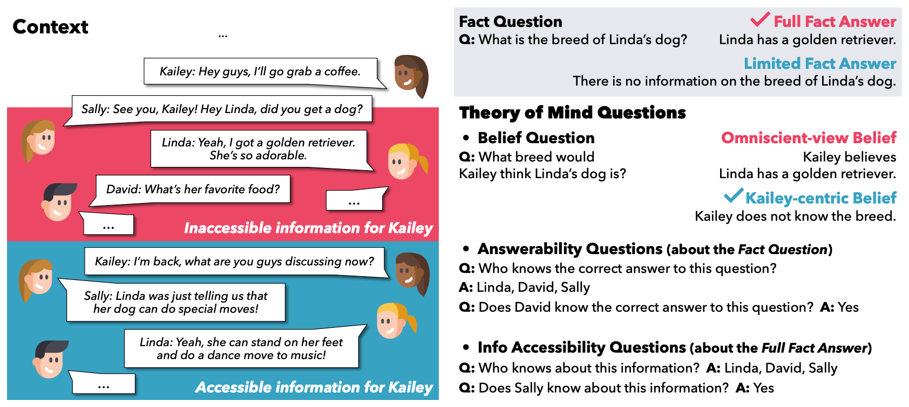

# 👻 FANToM

This is the official repository of our paper:<br>
<a href="https://arxiv.org/abs/2310.15421"><b>FANToM: A Benchmark for Stress-testing Machine Theory of Mind in Interactions</b></a>



Please cite our work if you found the resources in this repository useful:

```bib
@inproceedings{kim2023fantom,
    title={FANToM: A Benchmark for Stress-testing Machine Theory of Mind in Interactions},
    author={Hyunwoo Kim and Melanie Sclar and Xuhui Zhou and Ronan Le Bras and Gunhee Kim and Yejin Choi and Maarten Sap},
    booktitle={EMNLP},
    year=2023
}
```
For a brief summary of our paper, please see this [webpage](https://hyunw.kim/fantom).

## 💻 Running evaluation on FANToM
​
First, create the conda environment by running:
```bash
conda env create -f environment.yml
```
​
and then activate it:
```bash
conda activate fantom
```

You can run the evaluation by running the following example command:
```bash
python eval_fantom.py --model gpt-4-0613
```
This will automatically download the new FANToM benchmark in `data`.
All evaluation results will be saved under `data/results`.

### Adding your own agent

All you need to do is create an agent class with the method `interact()` or `batch_interact()`.

## 🏆 Latest Results

We report evaluation results for newer models on the `short` conversation inputs. Scores are expected to be lower on the `full` conversation inputs.
The models are ranked according to the `All*` score and then the `All` score, and ties are broken based on the sum of `All AnswerabilityQ` and `All Info-AccessQ` scores.

| Model                   | All* |  All | BeliefQ [Choice] | BeliefQ [Dist.] | BeliefQ token-F1 | All AnswerabilityQ | AnswerabilityQ [List] | AnswerabilityQ [Y/N] | All Info-AccessQ | Info-AccessQ [List] | Info-AccessQ [Y/N] | FactQ token-F1 |
|-------------------------|:----:|:----:|:----------------:|:---------------:|:----------------:|:------------------:|:---------------------:|:--------------------:|:----------------:|:-------------------:|:------------------:|:--------------:|
| Human                   |      | 87.5 |       93.8       |                 |                  |        90.6        |          90.6         |                      |       90.6       |        90.6         |                    |                |
| GPT-4o-2024-05-13       |  0.8 |  2.0 |       49.7       |       17.1      |       36.2       |        12.0        |          41.7         |         65.5         |       17.0       |        21.7         |        86.9        |      46.9      |
| GPT-4-0125-preview      |  0.6 |  1.6 |       27.6       |       13.8      |       38.4       |        19.2        |          46.0         |         69.6         |        8.4       |        17.2         |        77.1        |      49.4      |
| Gemini-1.5-flash        |  0.6 |  1.4 |       44.4       |       37.9      |       27.6       |        10.3        |          39.0         |         59.7         |        8.6       |        14.2         |        75.2        |      44.9      |
| GPT-4-turbo-2024-04-09  |  0.3 |  1.6 |       42.6       |       12.5      |       34.0       |        21.5        |          46.6         |         70.5         |        6.4       |        13.4         |        75.7        |      45.8      |
| Llama-3-70b-chat-hf     |  0.3 |  0.6 |       73.8       |       40.3      |       37.4       |         7.8        |          21.4         |         67.4         |        1.7       |         2.7         |        82.6        |      54.9      |
| Mixtral-8x22B-Inst-v0.1 |  0.2 |  0.5 |       36.7       |       32.3      |       46.4       |         3.9        |          24.0         |         54.5         |       12.9       |        20.9         |        80.3        |      58.9      |
| Gemini-1.0-pro          |  0.2 |  0.2 |       25.8       |       65.6      |       42.0       |         0.2        |          18.1         |         16.8         |       16.5       |        32.9         |        77.7        |      47.6      |
| Mixtral-8x7B-Inst-v0.1  |  0.2 |  0.2 |       35.4       |        9.3      |       46.0       |         1.4        |          28.5         |         40.4         |        3.7       |        17.9         |        52.4        |      54.1      |
| GPT-3.5-turbo-0125      |  0.2 |  0.2 |       10.1       |       11.0      |       45.0       |         3.3        |          41.2         |         56.8         |        1.1       |        32.3         |        61.7        |      55.4      |
| GPT-3.5-turbo-1106      |  0.2 |  0.2 |        9.6       |       15.7      |       41.7       |         3.4        |          44.6         |         62.4         |        0.3       |        26.2         |        59.8        |      54.3      |
| Claude-3-Opus-20240229  |  0.2 |  0.2 |       79.2       |       24.0      |       29.7       |         0.8        |           6.1         |         52.4         |        0.6       |         0.8         |        82.6        |      34.4      |
| Llama-3-8B-chat-hf      |  0.2 |  0.2 |       57.8       |       53.7      |       16.1       |         0.3        |           7.8         |         41.3         |        0.8       |         5.9         |        65.8        |      21.5      |
| GPT-4-1106-preview      |  0.0 |  0.2 |       51.9       |       20.3      |       33.7       |         6.6        |          28.5         |         50.6         |        4.7       |         8.7         |        77.8        |      46.2      |
| Zephyr 7B beta          |  0.0 |  0.2 |       41.5       |       33.2      |       41.1       |         0.6        |          13.6         |         56.0         |        0.9       |         6.1         |        56.0        |      37.1      |
| Claude-3-Sonnet-20240229|  0.0 |  0.0 |       45.1       |       24.4      |       32.4       |         0.5        |          17.2         |         24.7         |        1.2       |         3.0         |        70.2        |      34.9      |
| Gemma 7B Instruct       |  0.0 |  0.0 |       44.4       |       19.4      |       30.7       |         0.2        |           3.9         |         51.5         |        0.8       |        15.9         |        56.1        |      26.3      |

## Results on the Control Task

Our code additionally evaluates performance on the control task, which consists of conversations without information asymmetry (i.e., task without false belief). The results will be dumped under `data/results`. You can see the models perform significantly better on these than on the original task involving information asymmetry (i.e., task involving false belief). Moreover, the performance gap between models is much smaller. **Please ensure that the performance on the control task remains stable when testing your method or model.**

| Model                   |  All*  |  All   | BeliefQ [Choice] | BeliefQ [Dist.] | BeliefQ token-F1 | All AnswerabilityQ | AnswerabilityQ [List] | AnswerabilityQ [Y/N] | All Info-AccessQ | Info-AccessQ [List] | Info-AccessQ [Y/N] | FactQ token-F1 |
|-------------------------|:------:|:------:|:----------------:|:---------------:|:----------------:|:------------------:|:---------------------:|:--------------------:|:----------------:|:-------------------:|:------------------:|:--------------:|
| GPT-4o-2024-05-13       |  44.0  |  45.5  |       88.3       |       94.1      |       42.3       |        17.5        |          76.0         |         63.9         |       59.4       |        90.8         |        91.6        |      46.9      |
| GPT-4-turbo-2024-04-09  |  17.1  |  18.4  |       87.6       |       95.8      |       38.6       |        23.1        |          62.4         |         69.3         |       76.9       |        86.9         |        97.1        |      45.8      |
| Llama-3-70b-chat-hf     |  17.1  |  18.4  |       85.6       |       91.0      |       45.0       |        28.4        |          82.5         |         72.6         |       56.3       |        94.8         |        90.9        |      54.9      |
| GPT-4-0125-preview      |  16.7  |  18.0  |       93.6       |       96.2      |       43.7       |        23.1        |          68.1         |         71.8         |       76.9       |        82.1         |        98.0        |      49.4      |
| GPT-3.5-turbo-0125      |  14.0  |  14.0  |       96.0       |       96.5      |       48.4       |        15.7        |          34.5         |         74.3         |       67.7       |        69.0         |        99.4        |      55.4      |
| Gemini-1.5-flash        |  10.1  |  12.7  |       87.9       |       86.1      |       34.3       |        14.4        |          62.9         |         63.1         |       79.9       |        91.7         |        96.4        |      44.9      |
| Mixtral-8x22B-Inst-v0.1 |   3.5  |   3.5  |       85.7       |       90.7      |       49.5       |         4.8        |          50.2         |         43.3         |       67.7       |        84.7         |        94.7        |      58.9      |
| Claude-3-Opus-20240229  |   1.3  |   3.9  |       71.3       |       85.9      |       30.0       |         5.7        |          85.6         |         40.9         |       73.4       |        96.9         |        95.8        |      34.4      |
| Llama-3-8B-chat-hf      |   0.9  |   1.8  |       92.1       |       74.4      |       21.1       |         2.6        |          74.7         |         33.9         |       36.2       |        82.1         |        81.5        |      21.5      |
| Claude-3-Sonnet-20240229|   0.4  |   0.4  |       81.4       |       87.2      |       29.5       |         0.9        |          82.5         |         20.5         |       23.1       |        96.5         |        66.8        |      34.9      |
| Gemini-1.0-pro          |   0.0  |   0.0  |       84.3       |       63.6      |       37.3       |         0.0        |          19.2         |          3.0         |       48.9       |        70.3         |        89.0        |      47.6      |
| Mixtral-8x7B-Inst-v0.1  |   0.0  |   0.0  |       83.9       |       96.3      |       48.5       |         1.7        |          41.5         |         32.7         |        9.6       |        84.7         |        54.3        |      54.1      |
| Gemma 7B Instruct       |   0.0  |   0.0  |       44.1       |       89.9      |       37.3       |         0.0        |           0.4         |         67.5         |        1.7       |         8.7         |        73.6        |      26.3      |

## ⚠️ Intended Use of Data

The samples in FANToM should only be used for evaluation purposes. 

## 💡 Disclaimer

1. We are not claiming that machines have minds. They do not have minds, emotions, or intentions. However, they do need social reasoning capabilities to better understand information.
2. These multi-party conversations were generated by GPT-4 and they were validated by humans. The conversations do not necessarily reflect the views and opinions of the authors and their associated affiliations.
